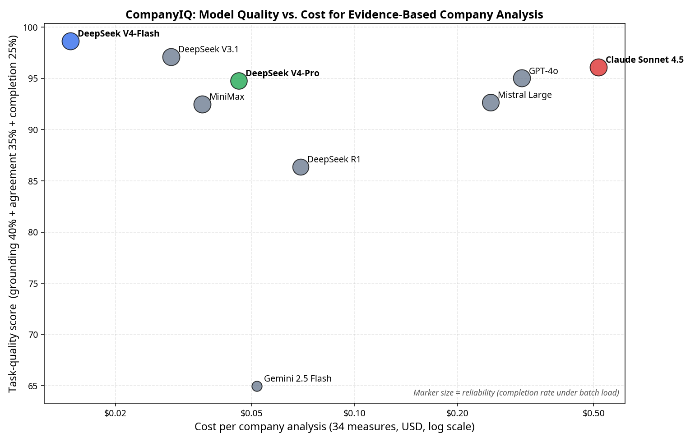

# CompanyIQ — LLM Quality vs. Cost Comparison for the Company-Analysis Task

**Date:** 12 June 2026
**Scope:** Empirical benchmark of every model wired into CompanyIQ's provider registry, evaluated on the *actual* production scoring step (binary measure scoring against a framework, with verbatim-evidence requirements and strict anti-inference rules).

---

## 1. Why a task-specific comparison (not generic benchmarks)

CompanyIQ does not ask a model to "be smart" in the abstract. It asks each model to perform one narrow, high-stakes job, repeated tens of thousands of times:

> Given a measure definition, scoring guidance, and a pack of retrieved evidence text, decide **Yes / No / Partial**, assign a **confidence**, and return **verbatim quotes** that are actually present in the evidence — while obeying anti-inference rules (e.g. alliance membership is not a company commitment; intensity targets are not absolute targets).

For this job, the qualities that matter are not the ones generic leaderboards reward. They are, in order:

1. **Evidence discipline** — does the model ground its verdict in quotes that are genuinely in the source text, or does it paraphrase/fabricate?
2. **Anti-inflation / strictness** — does it resist scoring "Yes" on weak or inferential evidence? (Per the project's quality-control preference, the risk is *inflated* scores, not missed ones.)
3. **Verdict stability / agreement** — does it agree with the cross-model consensus on the same evidence, or is it an outlier?
4. **Reliability under batch load** — does it complete every call without rate-limit or format failures across a long batch?
5. **Cost per company** — total spend to score a full framework for one company.
6. **Latency** — wall-clock per measure (matters for batch throughput).

This document scores every model on exactly these axes, using a replay of the production prompt on real companies from the live database.

---

## 2. Method

A standalone harness (`server/scripts/benchmark.ts`) imports the **real** production functions — the evidence-pack builder (`buildEvidencePacksForCategory`, BM25 retrieval, 1,500-char chunking, 8,000-char cap) and the **exact** binary-scoring system/user prompt from `analyzer.ts` — and replays the identical scoring call across all candidate models. The only variable is the model; evidence and prompt are byte-identical per cell.

| Parameter | Value |
|---|---|
| Frameworks | #7 AI Governance & Strategy (34 measures), #3 Bank Financed Emissions (27 measures) |
| Companies | Capgemini, Tyson Foods, Delta Electronics (AI Gov); KBC Groep, AlRayan Bank (Bank Emissions) |
| Measures sampled | 8 per framework (evenly across categories) |
| Evidence source | Live production DB — real fetched documents, deduplicated via `document_content` |
| Cells | 40 unique (company × measure) cells |
| Calls | 40 × 9 models = **360 real scoring calls** |
| Decoding | `temperature: 0`, `maxTokens: 2000`, JSON mode where supported |

**Quote-grounding metric:** each returned quote is checked for verbatim presence in the evidence text (exact match, with a 60%-contiguous-window fallback). The grounding rate is the fraction of quotes that are genuinely traceable to the source — a direct, objective measure of evidence discipline.

---

## 3. Headline results

All metrics computed over the 360 calls. "Quality on success" excludes failed calls so a reliability problem (rate-limits) does not get mislabeled as a quality problem.

| Model | Route | Completion | Quote grounding | Consensus agreement | Yes-rate (strictness) | Avg latency | Cost / company (34 meas) |
|---|---|---:|---:|---:|---:|---:|---:|
| **DeepSeek V4-Flash** (`deepseek-chat`) | DeepSeek direct | **100%** | **97%** | **100%** | 15% | 4.2 s | **$0.015** |
| DeepSeek V3.1 | OpenRouter | **100%** | **97%** | 95% | 10% | 17.7 s | $0.029 |
| **DeepSeek V4-Pro** | DeepSeek direct | 92% | 94% | **97%** | 5% | 18.2 s | $0.046 |
| Claude Sonnet 4.5 | Anthropic direct | **100%** | 95% | 95% | 20% | 11.6 s | $0.517 |
| GPT-4o | OpenAI direct | **100%** | 92% | 95% | 15% | 2.9 s | $0.308 |
| MiniMax-Text-01 | MiniMax direct | **100%** | 92% | 88% | 28% | 12.8 s | $0.036 |
| Mistral Large | Mistral direct | 95% | 92% | 92% | 24% | 6.4 s | $0.250 |
| DeepSeek R1-0528 | OpenRouter | 85% | 86% | 88% | 3% | 48.8 s | $0.070 |
| Gemini 2.5 Flash | Google direct | **18%** | 64% | 100% | 29% | 1.3 s | $0.052 |

Notes:
- **Cost** uses measured token footprint (~2,746 input + 180–460 output tokens per measure) × current per-million pricing (sourced June 2026; see §6).
- **Gemini's 18% completion** is entirely **rate-limit / quota exhaustion** (33 of 40 calls returned HTTP 429 "quota exceeded" or "high demand"), not a quality defect. On its 7 successful calls its grounding was weaker (64%) and it leaned permissive (high Yes-rate). This empirically reproduces the known batch-reliability issue that already drove the "DeepSeek-primary" preference.
- **DeepSeek R1** failures were format-related (5 JSON-parse failures from reasoning leakage, 1 other) even after `<think>`-stripping and a JSON-only retry.
- **DeepSeek V4-Pro** had 3 JSON-parse failures (of 40) on the most evidence-dense measures — as a "thinking" model it occasionally leaks reasoning into the output. This is milder than R1 and is addressable with the same defensive parsing the analyzer already applies.

---

## 4. What the numbers mean for *this* task

### Evidence discipline (the most important axis)
DeepSeek V4-Flash and DeepSeek V3.1 lead on verbatim grounding (**97%**), with Claude just behind (95%). In practice this means when these models cite a quote, it is almost always genuinely in the source — exactly what an auditable assessment needs. Gemini's 64% means roughly a third of its quotes could not be located verbatim, a real provenance risk for a sourced framework.

### Strictness and score inflation
The frameworks are deliberately hard (low Yes-rates are expected and desirable). Reading the Yes-rate as a strictness dial:
- **R1 is the strictest** (3% Yes) — but this cuts both ways (see false-negative finding below).
- **DeepSeek V4-Pro is the next strictest (5% Yes) — and, crucially, its strictness is well-calibrated, not over-rejection** (see below). This makes it the standout "high-tier" candidate.
- **DeepSeek V4-Flash, GPT-4o** sit at a healthy 15%; **Claude** at 20%.
- **MiniMax (28%) and Mistral (24%)** are the most permissive — a mild score-inflation tendency, which is the specific failure mode the project's QC preference warns against.

### Verdict stability
40 cells, 8 models: **33 of 40 (≈83%) were unanimous**, which is strong evidence the framework + prompt are robust regardless of model. The 7 split cells were all genuinely judgment-heavy measures. Two concrete patterns from the raw data:

- **R1 over-rejects on present evidence.** On KBC's *coal-capacity-exclusion* and *sectoral-lending-exposure* measures, R1 was the **lone "No" against six "Yes"** — its extreme strictness produces false negatives, not just resistance to inflation.
- **MiniMax/Mistral over-accept on borderline measures.** They appear on the "Yes" side of nearly every split (e.g. Capgemini *strategic-AI-partnerships*, Delta *AI-reskilling*), consistent with their higher Yes-rates.

DeepSeek V4-Flash matched the consensus on **100%** of cells — the best stability of any model tested.

### DeepSeek V4-Pro: strict but well-calibrated (the key new finding)
Unlike R1, V4-Pro's higher strictness is *discriminating*, not *over-rejecting*. Across its 37 successful cells it:
- diverged from consensus on **only 1 cell** (Capgemini *AI-reskilling-programme*, where it said "No" against four "Yes"),
- **never** over-accepted (0 cells where it said "Yes" while the majority said "No"), and
- split from the cheaper V4-Flash on **only 1 of 40 cells**.

In other words, V4-Pro reaches essentially the same verdicts as V4-Flash but is slightly more conservative on genuinely borderline measures — the desirable direction for a framework whose main risk is score inflation. Its one weakness is reliability: 3 JSON-parse failures (92% completion) on the hardest measures, versus V4-Flash's flawless 100%.

### Reliability under batch load
This is decisive for CompanyIQ's batch workload. Only five models completed 100% of calls under concurrent load: **DeepSeek V4-Flash, DeepSeek V3.1, Claude, GPT-4o, MiniMax**. Gemini collapsed to 18% on quota; R1 dropped to 85% on format; Mistral had 2 transient 429s.

### Latency
GPT-4o (2.9 s) and DeepSeek V4-Flash (4.2 s) are fastest. R1 is by far the slowest (48.8 s avg, 128 s p90) — unsuitable as a default batch backend regardless of its strictness appeal.

---

## 5. Cost in context

Per **full company analysis** (34 measures, single pass):

| Tier | Models | Cost/company | Relative to DeepSeek |
|---|---|---:|---:|
| Ultra-low | DeepSeek V4-Flash $0.015, V3.1 $0.029, MiniMax $0.036 | <$0.04 | 1–2.4× |
| Low | DeepSeek V4-Pro $0.046, Gemini $0.052, R1 $0.070 | <$0.08 | 3–4.7× |
| Premium | Mistral $0.250, GPT-4o $0.308, **Claude $0.517** | $0.25–0.52 | 17–35× |

At batch scale this dominates the economics. Scoring the full corpus (≈2,565 companies × 34 measures) once:

| Model | Approx. batch cost (one pass, all companies) |
|---|---:|
| DeepSeek V4-Flash | **≈ $38** |
| DeepSeek V3.1 (OpenRouter) | ≈ $75 |
| MiniMax | ≈ $92 |
| DeepSeek V4-Pro | ≈ $118 |
| GPT-4o | ≈ $790 |
| Claude Sonnet 4.5 | **≈ $1,325** |

DeepSeek V4-Pro is notable here: it delivers near-Claude-level conservative judgment and the second-best consensus agreement (97%) at **~11× less cost** than Claude and only ~3× more than V4-Flash.

Claude delivers marginally lower grounding (95% vs 97%) and **equal** consensus agreement (95% vs 100%) versus DeepSeek V4-Flash, at **~35× the cost**. For this task, the premium does not buy measurably better evidence discipline.

---

## 6. Pricing sources (per 1M tokens, cache-miss input / output, June 2026)

| Model | Input | Output | Source |
|---|---:|---:|---|
| DeepSeek V4-Flash (`deepseek-chat`) | $0.14 | $0.28 | api-docs.deepseek.com/quick_start/pricing |
| DeepSeek V4-Pro | $0.435 | $0.87 | api-docs.deepseek.com/quick_start/pricing |
| DeepSeek R1-0528 | $0.50 | $2.15 | openrouter.ai/api/v1/models |
| DeepSeek V3.1 | $0.21 | $0.79 | openrouter.ai/api/v1/models |
| Claude Sonnet 4.5 | $3.00 | $15.00 | anthropic.com/news/claude-sonnet-4-5 |
| GPT-4o | $2.50 | $10.00 | openai.com/api/pricing |
| Gemini 2.5 Flash | $0.30 | $2.50 | ai.google.dev/gemini-api/docs/pricing |
| Mistral Large | $2.00 | $6.00 | openrouter.ai (mistral-large) |
| MiniMax (M2 ref) | $0.26 | $1.00 | openrouter.ai (minimax-m2) |

> **Action item flagged:** DeepSeek is migrating to **V4**; the legacy `deepseek-chat` / `deepseek-reasoner` model names are **deprecated 2026-07-24** (they now map to V4-Flash non-thinking/thinking). The direct `deepseek` provider should be updated to the V4 names before that date.

---

## 7. Recommendation

For CompanyIQ's evidence-based company-analysis task, the data supports a clear tiering that also satisfies the multi-model redundancy preference:

| Role | Model | Rationale |
|---|---|---|
| **Primary (batch default)** | **DeepSeek V4-Flash** | Best evidence grounding (97%) and verdict stability (100% consensus), 100% completion under load, fastest-tier latency, cheapest by a wide margin. Already the project's chosen primary; the data strongly validates it. |
| **High-tier quality option** | **DeepSeek V4-Pro** | The best new addition. Strict but well-calibrated (5% Yes, 0 over-accepts, 97% consensus), 94% grounding, ~11× cheaper than Claude. Use it as the rigorous "second opinion" / arbiter on borderline measures, or as a higher-conviction batch backend where the 92% completion (fixable parsing) is acceptable. A far better high-tier DeepSeek choice than R1 (4× faster, better calibrated). |
| **Backup #1 (premium cross-check)** | **Claude Sonnet 4.5** | Highest-tier reasoning, 95% grounding, 100% completion. Use as the arbiter on split measures or spot-check QA — not the batch default (35× cost). |
| **Backup #2 (independent route, low cost)** | **DeepSeek V3.1 via OpenRouter** | Matches V4-Flash on grounding (97%), independent network path (resilience if DeepSeek-direct rate-limits), still ultra-cheap. |
| **Tertiary fallback** | **GPT-4o** | Fast, reliable, 92% grounding; a fully independent vendor for redundancy. |
| **Use with caution** | MiniMax, Mistral | Functional now (after the fixes below) but mildly inflation-prone (higher Yes-rate); acceptable as overflow capacity, not for primary scoring. |
| **Not recommended as default** | Gemini 2.5 Flash (rate-limits under batch), DeepSeek R1 (too slow at ~49 s/call; over-rejects valid evidence; format instability) | V4-Pro now supersedes R1 as the strict high-tier DeepSeek option. |

**Optional high-confidence mode:** for the subset of judgment-heavy measures, an **ensemble** of DeepSeek V4-Flash + DeepSeek V4-Pro (with disagreement escalated to Claude) gives a strict, well-calibrated cross-check for only ~$0.06/company — essentially free relative to a Claude-only pass, while keeping a premium arbiter only for the rare splits.

---

## 8. Provider-wiring fixes made during this work

These were discovered empirically while building the benchmark and are now fixed in `server/lib/ai-providers.ts`:

1. **Mistral was non-functional.** Every Mistral scoring call returned HTTP 422 because the provider sent a `seed` parameter that the Mistral API rejects (`extra_forbidden`). Added a `supportsSeed` flag (default true) and disabled it for Mistral. Mistral now scores correctly.
2. **MiniMax base URL + JSON mode.** Corrected base URL to `https://api.minimax.io/v1` (the old `api.minimax.chat` returns 401) and disabled `response_format: json_object` (MiniMax rejects it). MiniMax now scores correctly.
3. **OpenRouter added** as two providers — `openrouter` (DeepSeek V3.1) and `deepseek-r1` (DeepSeek R1-0528) — with key rotation and the required OpenRouter attribution headers, and a `supportsJsonMode` opt-out for reasoning models.

All four changes are backward-compatible and isolated to the provider layer.
